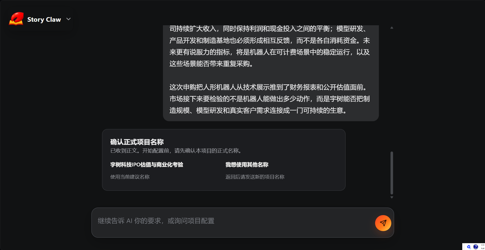
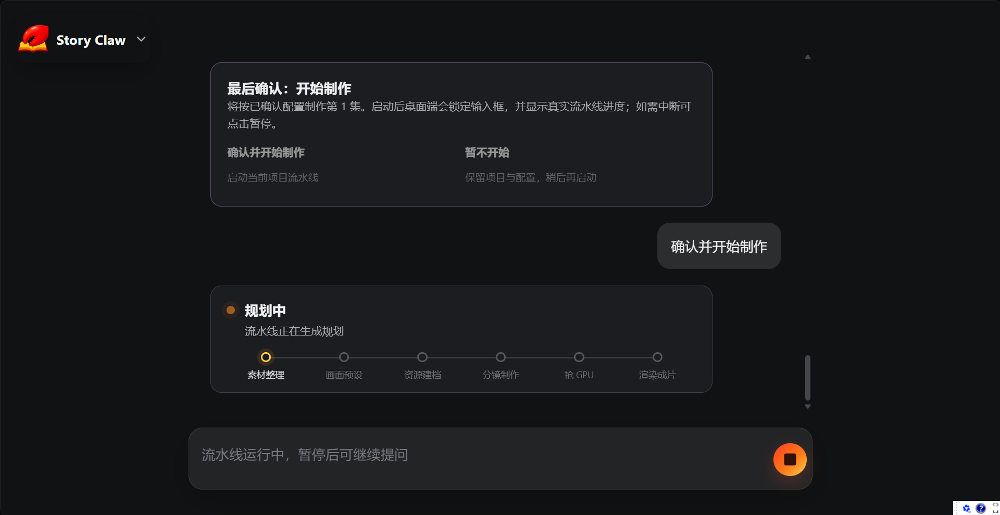

# Story Claw 产品展示与项目说明

Story Claw 是一个面向网络文学作者、短剧制作团队和独立创作者的 AI 短剧生产工具。它把一章小说文字拆解为可执行的内容生产任务，再自动完成剧本分场、分镜设计、角色与场景资产管理、配音、音效、画面生成和视频渲染。

项目目标不是只生成一张图片或一段孤立的视频，而是让创作者能够持续地把长篇故事生产成多集、风格统一、角色连续的短剧内容。

> 本页面用于展示 Story Claw 的产品形态和当前本地可运行版本。项目目前由独立开发者维护，尚未注册公司；页面中的用户规模、收入和商业化内容属于后续验证计划，不代表已经取得的业绩。

## 项目要解决的问题

把网络小说改编成短剧，真正困难的部分通常不在于生成某一张图片，而在于长流程的一致性和可重复执行：

- 长篇小说需要逐章改编，人工拆剧本、做分镜和安排素材的成本很高。
- 角色在受伤、换装或携带新道具后，参考图需要随剧情进入新的视觉阶段。
- 同一个角色在不同章节中必须保持相近的外观和声音，否则观众会失去连续感。
- 画面生成、配音、视频生成和后期合成由不同工具完成，失败后很难从中断位置继续。
- 视频模型偶尔会产生额外人脸、人物身份漂移或残留字幕，需要在成片前进行质量检查。
- 依赖按秒收费的视频 API 会让长篇、多集内容的成本快速上升。

Story Claw 将这些问题整合进一条可追踪、可恢复的生产流水线中。

## 目标用户

### 第一阶段用户

- 有网络小说版权或原创故事的个人作者
- 需要快速验证题材和剧情的短剧工作室
- 负责脚本、分镜和内容运营的制作团队
- 能够独立开发、但缺少完整视频制作团队的 Builder

### 后续用户

- 有多语言改编需求的内容机构
- 面向海外平台生产本地化短剧的团队
- 需要把内部故事、课程或品牌内容转成连续视频的企业内容团队

## 产品工作流

每一集从章节文本开始，经过五个主要阶段：

```text
小说章节 .txt
    |
    v
1. 画面预设      逐句识别场景、人物、景别、角度、镜头运动、光影和情绪
    |
    v
2. 资源建档      建立角色/场景资料，生成阶段化参考图并分配角色音色
    |
    v
3. 剧本分场      按场景把原文切分为独立剧本文件
    |
    v
4. 分镜制作      为每个场景生成逐句分镜、画面提示词和视频提示词
    |
    v
5. 渲染合成      配音、音效、画面生成、视频生成、质检和集成片
    |
    v
最终输出 ep{集数}.mp4
```

### 1. 画面预设

系统先对章节逐句分析，记录每句话对应的场景、人物、景别、镜头角度、镜头运动、光影、情绪、语言和独白信息。这样后续的分场和分镜有统一的原文依据，而不是让每个步骤重新猜测上下文。

### 2. 资源建档

系统识别本章出现的角色和场景，并为它们建立可以跨章节复用的资产：

- 角色原型图和必要的阶段造型图
- 场景底图以及不同时间、光线和道具状态的变体
- 角色到 TTS 音色的持久化映射
- 可由用户手动加入的真实参考图

只有当服装、身体状态或携带道具发生有意义的视觉变化时，才新增角色阶段图，避免长篇小说每一章重复生成全部角色资产。

### 3. 剧本分场

系统按场景将章节拆成多个独立剧本文件。每个场景可以单独进行分镜和渲染，最后再依据原文顺序重新合并，适合并行处理较长章节。

### 4. 分镜制作

每个场景的分镜数据以 JSONL 保存。每个分镜包含原文、画面提示词、视频提示词、时长相关信息以及可选音效标记。

人物身份会以内联标签写入提示词，例如 `[角色名·阶段]`。渲染时，资源选择器根据标签从角色现有的阶段图中选择参考图，并将身份标签替换为模型可理解的参考图指代，从而减少人物串用。

### 5. 渲染合成

渲染阶段先完成每个分组的 TTS，再使用真实音频时长驱动画面时长。这样人物说话、旁白和画面切换之间的对齐不依赖简单的字数估算。

随后系统会并行生成分镜图片和视频片段，并完成：

- 角色音色和旁白音色复用
- BGM 和字级音效叠加
- 角色/场景参考图选择
- 连续镜头的尾帧衔接
- 场景视频拼接和整集合并
- 人物一致性、额外人脸和字幕残留检查

## 核心能力

### 阶段化角色与场景资产

角色不是一张永久不变的头像。系统把服装、身体状态和道具变化记录为阶段资产，同时跨章节共享基础资料。它在减少重复生图成本的同时，也让故事中的视觉变化能够被保留。

### 全剧统一音色

角色第一次出现时从可用音色池中分配一个声音，并写入当前小说的 `voice_map.json`。后续章节根据角色名复用同一音色，旁白使用独立的 narrator voice，避免角色音色和旁白音混用。

### 音频驱动画面时长

系统以真实 TTS 音频时长作为每个分组的时间基准，再将时间分配到组内分镜。这个方式比按字数估算更适合对白、停顿和旁白比例变化明显的短剧内容。

### 视觉质量检查

视频生成结果可以接入基于视觉语言模型的质量 Gate，检查首尾帧中的人物一致性、异常人脸和去字幕后的残留文字。失败时自动重试，达到重试上限后放行，避免单个片段无限阻塞整集制作。

### 进度记录与断点续跑

改编进度按集、按阶段记录在 `改编进度.json` 中。重新运行同一集时，已经完成的阶段会被跳过；只生成图片的模式也可以先产出静态分镜，之后再补视频和音频。

### 自有 GPU 渲染

视频生成默认使用自部署的 ComfyUI + LTX 工作流。这样可以把 GPU 作为自己的生产基础设施，减少对按秒计费视频接口的依赖，也便于在云端 GPU、工作室服务器或本地机器之间迁移。

## 技术架构

当前版本采用本地优先的架构：

| 层 | 当前实现 |
| --- | --- |
| 运行时 | Node.js、TypeScript、tsx |
| 流程编排 | CLI + LLM sub-agent + 分阶段进度记录 |
| 文本与分镜 | LLM API，输出结构化文本和 JSONL 分镜 |
| 图片生成 | `gpt-image-2` 为主，Gemini image model 作为降级路径 |
| 视频生成 | ComfyUI + LTX-2.3 image-to-video 工作流 |
| 语音合成 | 支持角色音色映射和字级时间戳的 TTS |
| 后期处理 | ffmpeg，负责音频拼接、音效混音和视频合成 |
| 质量检查 | VLM 驱动的角色/人脸一致性与字幕检查 |
| 输出格式 | PNG、MP3/WAV、MP4、JSONL 和阶段进度 JSON |

当前版本的核心代码和本地运行方式见仓库根目录的 [README](../../README.md)。

## AWS 云化计划

当前产品已经可以在本地运行完整流程；下一步是把本地单机工作流升级为可协作、可扩展的云端产品。以下是计划使用 AWS 的方向，属于产品路线，不代表这些云服务已经全部接入：

### 生成式 AI 与文本处理

- 使用 Amazon Bedrock 接入可替换的文本理解、剧本改编、分镜生成和视觉质检模型。
- 通过统一模型适配层保留不同模型的切换能力，按成本、语言和质量选择模型。
- 对提示词、角色设定和分镜数据进行版本化，方便复现和评估。

### 素材与结果存储

- 使用 Amazon S3 保存原始章节、角色图、场景图、分镜图片、音频和视频成品。
- 使用对象元数据和版本号管理不同章节、阶段资产和渲染结果。
- 使用 CloudFront 为团队成员和创作者提供较快的素材预览和成片播放。

### 长任务编排

- 使用 Amazon SQS 或 EventBridge 拆分和调度章节改编、图片生成、TTS、视频渲染等异步任务。
- 使用 ECS 或 EKS 运行 API、任务协调器和轻量处理服务。
- 使用带 GPU 的 EC2 或 AWS Batch 承载 ComfyUI/LTX 等视频生成任务，并依据队列长度调度 GPU。
- 每个任务保留状态、日志和失败原因，支持重试、取消和断点恢复。

### 账号、监控与成本

- 使用 IAM、Secrets Manager 和 KMS 管理用户权限、API 密钥和素材访问。
- 使用 CloudWatch 记录任务耗时、模型错误、GPU 利用率和渲染失败率。
- 按用户、项目、章节和渲染任务记录成本，未来可以支持订阅额度和按量计费。

### 海外扩展

- 通过多语言模型、不同地区的 TTS 音色和字幕流水线支持英文及其他语言。
- 将章节、角色设定、分镜和成片作为可审阅的协作对象，方便跨地区的作者、编剧和后期团队共同工作。

## 商业化假设与验证路径

Story Claw 计划先从“缩短一集短剧从文字到成片的时间”这个明确价值切入，而不是一开始覆盖所有视频生产场景。

### 可能的产品形态

- 面向个人作者的基础订阅，提供章节改编、资产管理和有限渲染额度。
- 面向短剧工作室的团队版，提供多人协作、项目空间、资产复用和批量任务。
- 面向内容机构的企业版，提供私有素材空间、权限、审计和定制模型接入。
- 对高成本 GPU 视频渲染采用订阅额度加按量计费的组合方式。

### 早期验证指标

后续将通过真实创作者试用验证：

- 从章节文本到第一版分镜的耗时
- 从第一版分镜到整集成片的耗时
- 每分钟成片的推理和 GPU 成本
- 角色和声音一致性问题的返工率
- 用户完成第二集、第三集的比例
- 创作者愿意持续付费的功能和工作流环节

这些指标用于验证产品是否真正减少制作成本和时间，而不是只追求单次生成效果。

## 产品截图

### 产品首页

展示从章节文本进入 Story Claw 的入口，以及自动人物风格和完整模式等主要工作流选项。


### 集工作台

展示一集短剧的分镜数量、总时长、分镜预览、生成控制和阶段进度。截图中的示例展示了从对话入口到服务履约平台的短剧画面工作流。


### 项目确认与商业化思考

展示产品在项目配置阶段对正式项目名称、IPO/商业化假设和后续项目路线的确认过程。



### 生产流水线

展示从确认开始制作到素材整理、画面预设、资源建档、分镜制作、GPU 渲染和成片输出的阶段化进度。



## 项目链接

- [Story Claw 源代码与完整说明](../../)
- [产品截图目录](./)
- [在线截图展示页](https://github.com/ZC89757/story-claw/tree/main/assets/showcase)
- [示例视频 1：AI Hot News](../demo1.mp4)
- [示例视频 2：Murder on the Orient Express](../demo2.mp4)

## 项目现状

- 已完成本地 CLI 和桌面端工作流。
- 已实现从章节输入到分镜、配音和视频渲染的主要链路。
- 已实现角色/场景资产复用、角色音色映射、进度记录和断点续跑。
- 已有本地可运行版本和实际生成的界面截图及示例视频。
- 当前仍处于独立开发和产品验证阶段，云端多租户、计费和大规模商业部署是后续工作。

## License

本项目采用 [MIT License](../../LICENSE)。
